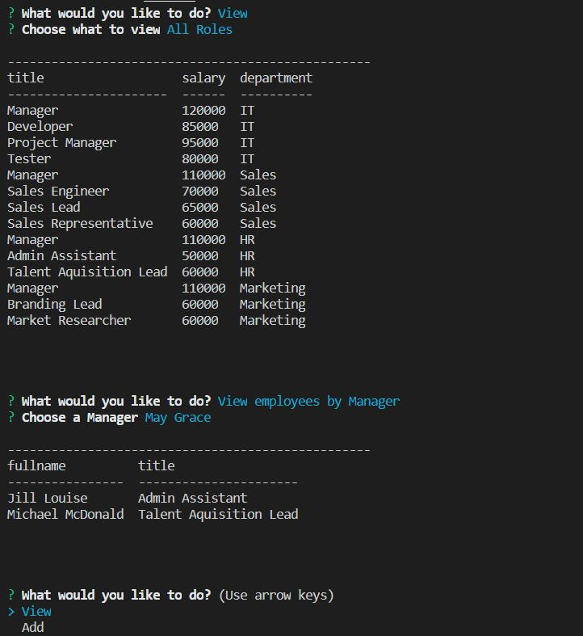

# employeeTracker
A content Management System that uses MySQL database, Node and inquirer to manage employee information

## Description
This Application builds a html file using the information provided by user
## Table of Contents
* [Installation](#installation)
* [Usage](#usage)
* [License](#license)
* [Contributing](#contributing)
* [Tests](#tests)
* [Questions](#questions)
## Installation
A seed.sql is provided to explain the Tables used for this application
* department:
    * id - INT PRIMARY KEY
    * name - VARCHAR(30) to hold department name

* role:
   * id - INT PRIMARY KEY
   * title -  VARCHAR(30) to hold role title
   * salary -  DECIMAL to hold role salary
   * dept_id -  INT to hold reference to department role belongs to

* employee:
   * id - INT PRIMARY KEY
   * first_name - VARCHAR(30) to hold employee first name
   * last_name - VARCHAR(30) to hold employee last name
   * role_id - INT to hold reference to role employee has
   * manager_id - INT to hold reference to another employee who is the manager of the current employee. This field may be null if the employee has no manager
## Usage
Create the database and tables and fill in the rows, schema.sql and seed.sql have been provided. Install the required mysql, inquirer and console.table NPM packages. In the terminal run the command "node employeeTracker.js". This command line interface allows the user to

* View
   * departments 
   * roles 
   * employees
* Add 
   * departments
   * roles 
   * employees
* Update employee roles
* View employees by manager
* Delete employees
* Utilized budget of a department
* Exit

Small demo

## License

## Contributing
## Tests

## Questions
* Vani Kalaparthy
  * https://github.com/vkalaparthy
  * kalaparthy.vani@gmail.com
